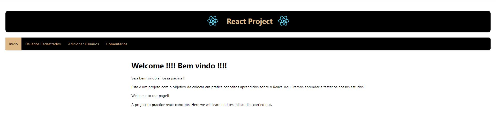
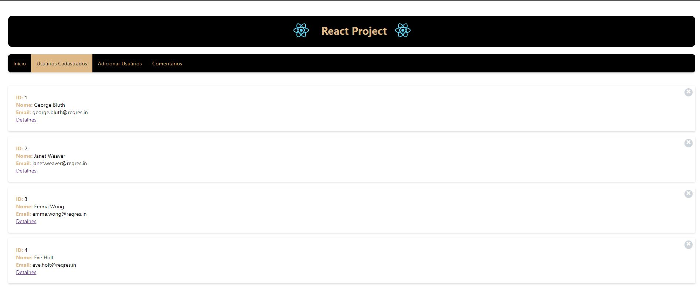
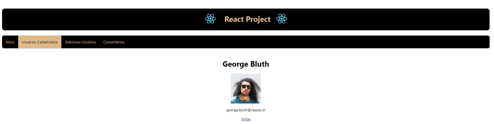
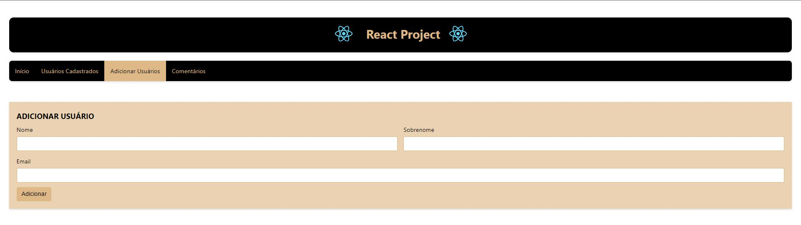
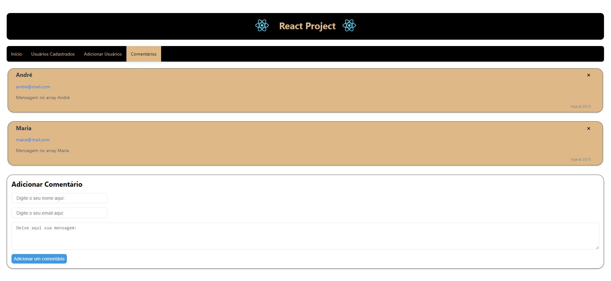

# React Project
A project to practice react concepts. Here we will learn and test all studies carried out.

The application was based on requests on API 'https://reqres.in/api'. 
So we have four options on menu below header, with options: "Inicio", "Usuários Cadastrados", "Adicionar Usuários", "Comentários".

- "Início": 
Here we have a welcome message. The main page, from there, you can choose which functionality to test.

- "Usuários Cadastrados":
On this page, a GET request is made to the API, from there we have a list of users provided by the API. Here we can choose to view user details by clicking on the "Detalhes" button.

- "Adicionar Usuários":
In this part we can add users by entering their name, last name and email. When clicking on the "Adicionar" button, a POST type request is made to the API, passing a body with the imputed data, after the API's response, the added user is listed on the screen.

- "Comentários": 
In this tab we can add comments that will be listed as the form is completed. We enter the data of name, email and message, after clicking on "Adicionar um Comentário" the entered data will be listed. It is worth mentioning that by default we already have three items that are already listed by default, in this step we can also delete added comments.

# 1 - Implemented items
This section will describe concepts that are used in implementation of this project. 
Each topic was approaches techniques and methodologies applicated to implement the system.

# 1.1 Basic Concepts and Syntax
- Creation of a project in React from scratch;
- Github configuration for code commits;
- Component creation using JSX:
    - Passing properties to components;
- Presetting application states using the setState() method;
- Event handling;
- Styling of components through CSS;
- Installing additional packages for formatting dates;

# 1.2 Using React with requests HTTP / Ajax
Was maked requests on this API: 'https://reqres.in/api'. Here has used GET to get and list users informations, POST to upload and list users informations that was inputed and DELETE metohd to remove informations that was listed on our page.

Concepts that was used:
- HTTP protocol;
- Response codes;
- HTTP methods (GET, POST and DELETE);
- fetch (native function of JavaScript to make async requests on server)

# 1.3 React Hooks
On this project was used concepts that abord: what is hook and the advantajes to use; rules to use hooks; how can we manipulate states using State Hook and how can we 
manipulate effects using Effect Hook.

# 1.4 Using Routes
- Using routes on SPA (single Page Application)
- Implementing a nav menu with each route doing your own function
- Defining routes
- Using and passing parameters in routes

# 1.7 Deploy
Acess application by link. 
https://react-basic-taupe.vercel.app/